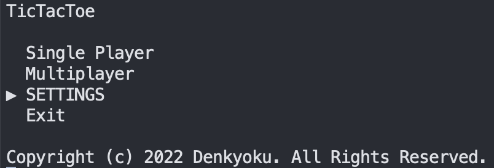
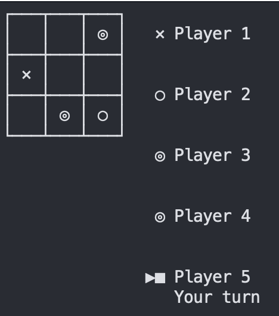
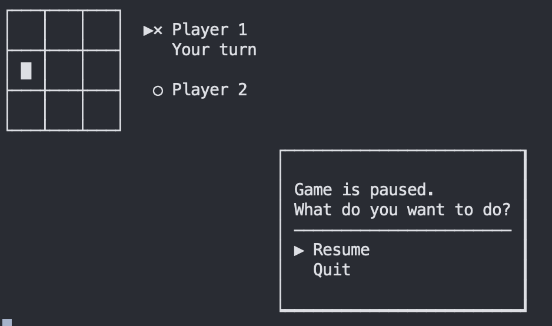
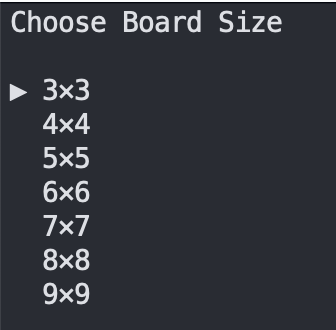
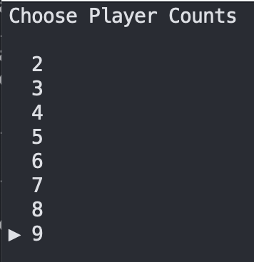
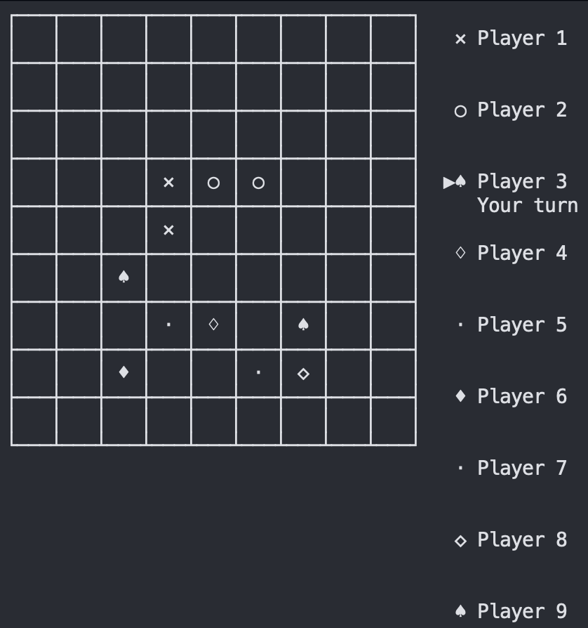

# Tic-Tac-Toe Readme

by Zhenghang Yin. 2022. Release under MIT License

Student Id: U82871437

> This is one of a series of assignments for the BU CS611 Java course. Because it is only for teaching evaluation, the original author is not responsible for any disputes and responsibilities arising from the use of this project.


### Compile and Run:

You must have at least Java 8 or OpenJDK 1.8 to build the project. Otherwise it's not guaranteed that it will work.

first clone this repo, and then inside the repo, type and enter:

```Bash
javac src/club/denkyoku/TicTacToe/*.java -d out/production/Tic-Tac-Toe
```


And to run:

```Bash
(cd out/production/Tic-Tac-Toe/ && java club.denkyoku.TicTacToe.Main)
```


### Features and Speciality:

#### Main Menu Theme:




The most commonly used interface in the game is called **Menu**. **Menu** is characterized by the fact that you can use the keyboard keys to select up/down, press Enter to enter, or press ESC to return to the previous menu.

#### Directly use up and down, left and right control to play



In the program, you can directly use the up, down, left and right keys to select and play without manually entering coordinates.
The details on this is implemented in `Game.java`. Actually, when a player has his turn, and game detected that it's not an AI player (which is a property defined in the player object), it will let user use kehys to play.

#### Dialog Interfaces




The game use Dialog interfaces to help player do what they want more quickly, without having to enter instructions or worry about entering wrong instructions. 

Use up and down keys to choose different options. Esc key can be used if the program letting you do so.

#### Customizing

The game letting you change board size or player counts.





Then you can make a super giant board, and play 9-In-a-Row game with friends.



#### An easy AI computer;

Notes: Without Deep learning, AI can only play with you when board size is $3\times3$.

### Class extensiblity

This project takes full account of scalability in each design place. In other words, you only need to modify some of the codes, or use some class overloads, you can easily rewrite this game into any board game, including Go, Gobang, Chess, Checkers, etc.

Each class that can be overloaded or customized is listed below:

#### Board Class:

The Board class is an abstract class used to define the most basic chessboard elements. The functions that have been implemented are (excluding attributes):

- `int at(x, y)`: It is used to access what player's chess pieces are currently under the board's positions in x and y. If it is 0, it means blank. If it is ≥ 1, it means the child corresponding to the player id (the player id is actually indexed from 0, and the number recorded here is the value after adding 1)
- `int atByOne(x, y)`: Like the at function, the only difference is that the x, y index starts from 1, not from 0.
- `void put(x, y)`: Make a move at (x, y). The Board object does not check whether the position of the slot already has a move. The caller Game object should first call the abstract function `canPut` to determine whether it can be in this place. The advantage of this is that some games may allow other players' move to be "eaten". This gives greater flexibility for expansion.
- `boolean isFull()`: Check if the whole board is full.
- `boolean isEmpty()`: Vice versa to above.

These functions are remained abstract:

- `abstract boolean canPut(x, y)`: Different rules of the game have their own rules on whether the next can be repeated in one place. Here I make it an abstract function so that subclasses can redefine the function.
- `abstract int check_win()`: Let the custom game class overload the rule of judging Win. Returning 0 means there is no Win, returning -1 means Draw, returning -2 means forced exit, and returning> 1 means the corresponding player id wins.

#### Player Class

The player class is a highly abstract class. It only implements the most basic functions, allowing users to easily transform it into any AI player.

There are two very important contents:

- `boolean isHumanPlayer`: This is an property. When a subclass inherits, it should clearly indicate whether this class is a human player. In the process of game processing, if a player is found to be a human player, it will open the up, down, left and right control keys to let the player control the position of move by himself. If `False`, `getMove(Board, myId, otherIds)` will be called to let the program automatically calculate the next move.
- `Move getMove(Board, int myId, int[] otherIds)`: Board object is required for AI to check the board and calculate. Then it is also necessary to provide the id corresponding to AI and the id corresponding to other players to help AI to calculate the current weight value. (Some methods like min/max algorithm, AI needs these stuffs to compute).

#### Menu and MessageDialog

These two classes implement the most basic interface in the game and are very easy to expand. The dialog boxes and menus that can be seen everywhere in the game prove this point.


- The `Menu` class accepts a series of strings that represent menu items. Then the program will automatically call the keyListener to monitor keyboard events to select menu items. After the execution is completed, the Menu.start() function returns the menu id selected by the user. This allows further operations to be performed.
- The `MessageDialog` class accepts a list of Message string, and button objects.
	Each button has its own Title, quick access key. In this way, the user can directly press the up and down or access key to access the corresponding button. If multiple buttons have the same access key, Dialog will automatically switch back and forth between these buttons. The user finally presses Enter to execute.

### Known problem

Because this program uses TTY-based technology, it can only run in Mac OS or Linux systems. The interaction key under the Windows will have problems and cannot be used. It is recommended to use `csa1.bu.edu` or `csa2.bu.edu` for evaluation.

I will find other compatibility solutions to solve the compatibility problems under Windows.

